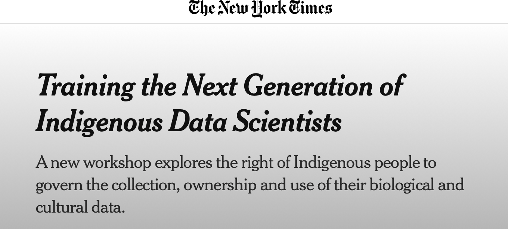
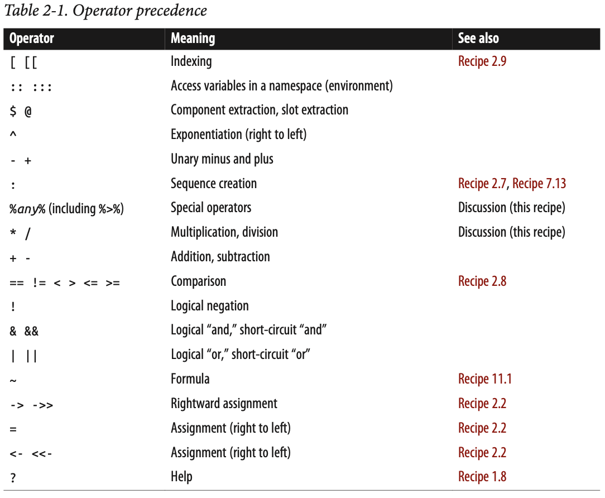

exclude: true


```{r, include = F}
# template refers to:@edrubin
if (!require("pacman")) install.packages("pacman")
library(pacman)
p_load(
  kableExtra, snakecase, janitor, huxtable, pagedown,                                                  # Formatting 
  ggplot2, ggthemes, ggeffects, ggridges, igraph, network, ggpubr, ggformula, gridExtra, RColorBrewer, # Visualization
  tidyverse, lubridate, stringr, dplyr, purrr, tibble, tidyr, lubridate, knitr,                        # General tidyverse toolkit 
  readxl,reshape2, 
  parallel, future, furrr, future.apply, doParallel,                                                   # Paralleling
  emIRT, MCMCpack, wnominate, pscl, rgenoud, basicspace,                                               # Measurement Scaling   
  devtools, reticulate, usethis                                                                        # programming
)


p_load_gh("kosukeimai/emIRT", # for scaling from Github
          "tzuliu/ooc",
          "cran/oc",
          "uniofessex/asmcjr",
          "wmay/dwnominate", dependencies = TRUE)


# Define colors
red_pink   = "#e64173"
turquoise  = "#20B2AA"
orange     = "#FFA500"
red        = "#fb6107"
blue       = "#3b3b9a"
green      = "#8bb174"
grey_light = "grey70"
grey_mid   = "grey50"
grey_dark  = "grey20"
purple     = "#6A5ACD"
brown      = "#9b684d"
black      = "#000000"
magenta_red = "#9b4d80"
magenta_green = "#4d9b68"
red_green = "#9b4d59"
blue_green = "#4d599b"
magenta_yellow = "#9b8f4d"


# Knitr options
opts_chunk$set(
  comment = "#>",
  fig.align = "center",
  fig.height = 7,
  fig.width = 10.5,
  warning = F,
  message = F
)
opts_chunk$set(dev = "svg")
options(device = function(file, width, height) {
  svg(tempfile(), width = width, height = height)
})
options(knitr.table.format = "html")

# pagedown::chrome_print("file:///Users/yenchiehliao/Dropbox/indigenous-data-scientists/Week-01/Week-01.html#1", verbose = FALSE)


```


---
layout: true
# 課程設計
---
name:
&nbsp;

### 我們課程主要包括：

- 作業環境、基礎R語言、資料結構與套件導入、R的社群生態   

--

- 向量(vector)、序列（list）、矩陣（matrix）、資料框架（dataframe） 

--

- 資料類型結構、Tidyverse 相關模組 、函數式編程 (functional programming)、循環 

--

- 資料視覺化EDA (explore data analysis) 、基礎統計分析與回歸、討論個人研究計畫

--

- 用R檢視地圖資料、製作互動式地圖、文本分析與應用、基礎機器學習 


---
layout: true
# 目的
---
name:

&nbsp;

### 為什麼我們要學習資料科學？

```{r echo = F, out.width = "50%"}

```

- 人工智能對政府部門運作、變革與影響

--

- 如果當政府部門開始用人工智能進行政策制定與評估時，會需要資料來建立模型。

--

- 原住民資料與代表性的問題？哪一天我們的政策會不會也被機器決定？


---

&nbsp;

```{r echo = F, out.width = "60%"}

```


---

&nbsp;

### 希望完成課程，大家都能夠：
- 基礎的資料分析知識

--

- 獨立用R完成分析

--

- 應用這些知識在自己的研究或工作計畫上

--

- 持續進修

---
layout: false
class: inverse, center, middle

# 開使吧！


---
layout: true
# 基礎（Some Basics）
---
name:

### 列印

```{r}
print("Hello World")
```

--

```{r}
print(pi)
```

--

```{r}
print(sqrt(2))

```


---

```{r}
print(matrix(c(1, 2, 3, 4), 2, 2))
```

--

```{r}
print(list("a", "b", "c"))
```

--

```{r eval=FALSE, include=TRUE}
print("The zero occurs at", 2 * pi, "radians.")
```

--

```{r eval=FALSE, include=TRUE}
num <- readline(prompt="有多少人: ")
cat("\n", "原住民族資料分析線上訓練工作坊：R的基礎與應用", "\n" ,"總共有", num, "\n")
```

---

### 建立變數

```{r}
x <- 3
```

--

```{r}
x <- 3
y <- 4
z <- sqrt(x + y) 
```

```{r}
print(z)
```

--

```{r}
x <- c("Lbak", "Uking", "是", "Truku") 
```

```{r}
print(x)

```

---

### 列出變數

```{r}
x <- 10
y <- 50
z <- c("Kacing", "David", "Liao")
```

--


```{r}
ls()
```

---

```{r}
ls.str()
```

---

### 刪除變數
```{r}
david <- "David is hot "
rm(x)
```

--

```{r}
rm(david, y, z)
```

--

```{r}
ls()
rm(list = ls())
ls()
```

---

### 製造簡單向量 (Vector)
```{r}
c(1, 1, 2, 3, 5, 8, 13, 21)
```

--

```{r}
c("好想", "吃", "momo", "paradise")
```

--

```{r}
c(TRUE, TRUE, FALSE, TRUE)
```

---

### 製造簡單序列 (Sequences)

```{r}
1:100
```

--

```{r}
100:1
```

---

```{r}
seq(from=1,to=100)
```

--

```{r}
seq(from=1,to=100,by=2)

```

---

```{r}
seq(from = 0, to = 100, length.out = 5)
```

--

```{r}
rep(1, times = 5)
```

---
layout: true
# 比較(Comparison)
---
name:

&nbsp;

### 語法


|     |          定義           |  
|-----|-------------------------|
| ==  | 等於                    | 
| !=  | 不等於                  |   
| <   | 小於                    |  
| >   | 大於                    |  
| <=  | 小於等於                |  
| >=  | 大於等於                |  

---

### 條件比較

```{r}
a <- 10
b <- 11
a == b 
```

--

```{r}
a != b
```

--

```{r}
a > b
a < b
a >= b
```

---

```{r}
v <- c(3, "david", 4)
w <- c("david", "david", 1)

```

```{r}
v == w 
v != w
```

--

```{r}
v < w
v <= w
```

---

```{r}
v > w
v >= w
```

--

```{r}
v <- c(3, 3, 4)
v == 4
v != 4
```

---

```{r}
a <- 1:10
```

--

```{r}
a > 5
```

--

```{r}
a < 5
```

--

```{r}
a == 5
```

---

```{r}
all(a > 5) 
```

--

```{r}
any(a > 5) 
```

--

```{r}
b <- a > 5
```

--

```{r}
any(b)
```

--

```{r}
all(b)

```

---

```{r}
c <- c(a, NA)
c > 5
```

--

```{r}
all(c > 5) 
```

--

```{r}
any(c > 5) 
```

--

```{r}
all(c < 20) 
```

--

```{r}
any(c > 20) 
```

---

```{r}
is.na(a)
```

--

```{r}
is.na(c)
```

--

```{r}
any(is.na(c))
```

--

```{r}
all(is.na(c))
```

---

### 提取資料（Selecting Vector Elements）
```{r}
truku <- 1:10
truku
```

--

```{r}
truku[1]
```

--

```{r}
truku[2]
```

---

```{r}
truku[1:3]
```

--

```{r}
truku[c(2, 5, 10)]
```

---

```{r}
truku[-1] # Ignore first element
```

--


```{r}
truku[1:3] # As before
```

--

```{r}
truku[-(1:3)] # Invert sign of index to exclude instead of select #> [1] 2 3 5 8 13 21 34
```

--

```{r}
num <- truku < 5 # This vector is TRUE wherever fib is less than 10

truku[num]
```

---

```{r}
v <- c(3,6,1,9,11,16,0,3,1,45,2,8,9,6,-4) 
v[ v > median(v)]
```

--

```{r}
v[ (v < quantile(v, 0.05)) | (v > quantile(v, 0.95)) ]
```

--

```{r}
v[ abs(v - mean(v)) > sd(v)]
```

--

```{r}
v<-c(1,2,3,NA,5) 
v[!is.na(v) & !is.null(v)]
```

---

```{r}
years <- c(1986, 1964, 1976, 1994)
names(years) <- c("Kennedy", "Johnson", "Carter", "Clinton")
years
```

--

```{r}
years["Carter"]
```

--

```{r}
years[1]
```

--

```{r}
years[c("Carter", "Clinton")]
```


---
layout: true
# 算數（Arithmetic）
---
name:

### 基本加減乘除
```{r}
v <- c(11, 12, 13, 14, 15) 
w <- c(1,2,3,4,5) 
```

```{r}
v + w
```

--

```{r}
v * w
```

--

```{r}
v / w
```

---

```{r}
w
```

--

```{r}
w + 2
```

--

```{r}
w - 2
```

--

```{r}
w * 2
```

--

```{r}
w / 2
```

---
layout: true
# 預告
---
name:

```{r echo = F, out.width = "60%"}

```

##### 參考書目：R Cookbook Proven Recipes for Data Analysis, Statistics, and Graphics by J. D. Long, Paul Teetor


