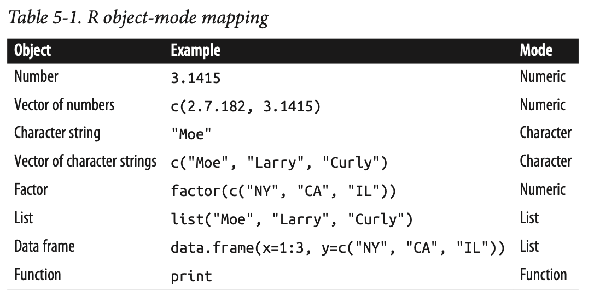

exclude: true


```{r, include = F}
# template refers to:@edrubin
if (!require("pacman")) install.packages("pacman")
library(pacman)
p_load(
  kableExtra, snakecase, janitor, huxtable, pagedown,                                                  # Formatting 
  ggplot2, ggthemes, ggeffects, ggridges, igraph, network, ggpubr, ggformula, gridExtra, RColorBrewer, # Visualization
  tidyverse, lubridate, stringr, dplyr, purrr, tibble, tidyr, lubridate, knitr,                        # General tidyverse toolkit 
  readxl,reshape2, 
  parallel, future, furrr, future.apply, doParallel,                                                   # Paralleling
  emIRT, MCMCpack, wnominate, pscl, rgenoud, basicspace,                                               # Measurement Scaling   
  devtools, reticulate, usethis                                                                        # programming
)


p_load_gh("kosukeimai/emIRT", # for scaling from Github
          "tzuliu/ooc",
          "cran/oc",
          "uniofessex/asmcjr",
          "wmay/dwnominate", dependencies = TRUE)


# Define colors
red_pink   = "#e64173"
turquoise  = "#20B2AA"
orange     = "#FFA500"
red        = "#fb6107"
blue       = "#3b3b9a"
green      = "#8bb174"
grey_light = "grey70"
grey_mid   = "grey50"
grey_dark  = "grey20"
purple     = "#6A5ACD"
brown      = "#9b684d"
black      = "#000000"
magenta_red = "#9b4d80"
magenta_green = "#4d9b68"
red_green = "#9b4d59"
blue_green = "#4d599b"
magenta_yellow = "#9b8f4d"


# Knitr options
opts_chunk$set(
  comment = "#>",
  fig.align = "center",
  fig.height = 7,
  fig.width = 10.5,
  warning = F,
  message = F
)
opts_chunk$set(dev = "svg")
options(device = function(file, width, height) {
  svg(tempfile(), width = width, height = height)
})
options(knitr.table.format = "html")

# pagedown::chrome_print("", verbose = FALSE)


```

---
layout: true
# 結構 (Data Structure)
---
name:
&nbsp;

&nbsp;

```{r echo = F, out.width = "60%"}

```

##### 參考書目：R Cookbook Proven Recipes for Data Analysis, Statistics, and Graphics by J. D. Long, Paul Teetor


---
layout: true
# 向量 (Vectors)
---
name:

建立一個向量，命名(`names()`) 它。
```{r}
v <- c(20, 20, "David", "Kaching")
names(v) <- c("Kacing", "Labak", "Truku")
print(v)
```

--

提取名稱為
```{r}
v[["Kacing"]]
```

--

```{r}
v["Kacing"]
```

---
layout: true
# 列表 (Lists)
---
name:

用`list()`建立list 物件
```{r}
a.list <- list(x = 1:6, 
               y = "a",
               z = c(TRUE, FALSE))
```


--

提取它
```{r}
a.list$x
```

--

另個方式提取它
```{r}
a.list[["z"]]
```

---

比較一下`a.list[["x"]]`與`a.list["x"]`
```{r}
a.list[["x"]]
```

```{r}
a.list["x"]
```

--

用`c()`提取，挑取特定的**vector**
```{r}
a.list[c(2,3)]
```


---
layout: true
# 矩陣 (matrix)
---
name:

`ncol = 1`的matrix
```{r}
one.col.matrix <- matrix(1:100, ncol = 2)

```


--

`ncol = 2`的matrix
```{r}
two.col.matrix <- matrix(1:6, ncol = 2)
two.col.matrix
```

--

構面
```{r}
dim(two.col.matrix)
```


---

建立4個col的matrix
```{r}
A <- matrix(1:20, ncol = 4)
```

--
matrix的遞遺性
```{r}
A + 1
```

---
layout: true
# factor (類化)
---
name:

```{r}
my.vector <- c(1, 1, 0, 0, 0, 1)
my.factor <- factor(x = my.vector,
                    levels = c(1, 0), 
                    labels = c("原住民", "不是原住民")) 
```

用`levels()`看㔌幾種類別
```{r}
levels(my.factor)
```


---
layout: true
# 內建函數 (build-in function)
---
name:

用`str()`查看**a.list**內容
```{r}
str(a.list)
```

--

用`append()`增加更多list 於之前的list
```{r}
another.list <- append(a.list, list(yy = 1:10, zz = letters[5:1]))
```

--

用`str()`查看
```{r}
str(another.list)
```

---

刪除某個list 中的vector 
```{r}
a.list$z <- NULL
```

--

鳥巢list (nested list)
```{r}
nested.list <- list(A = list("a", "aa", "aaa"), 
                    B = list("b", "bb")) 
```

--

用`str()`查看
```{r}
str(nested.list)

help(str)
```


---

用`is.list()`，判斷**nested.list**是否屬於list 性質
```{r}
is.list(nested.list)
```

--


用`unlist()`去**list**特質
```{r}
c.vec <- unlist(nested.list)
```

--

用`mode()`，判斷**nested.list**是否屬於list 性質
```{r}
mode(nested.list)
```

--

```{r}
names(nested.list)
```

--

```{r}
mode(c.vec)
```


---
layout: true
# 練習：提取鳥巢序列(nested list)
---
name:


首先，建立一個鳥巢list，嘗試提換別的數值。
```{r}
nested.list <- list(list("a", "aa", "aaa"), 
                    list("b", "bb"),
                    list("David", "is", "hot")) 
```

--

```{r}
str(nested.list)
```

--

用以下範例自己跑看看
```{r eval=FALSE, include=TRUE}
nested.list[1]
nested.list[[1]][2]
nested.list[[1]][[2]]
nested.list[2]
nested.list[2][[1]]
```

---
layout: true
# 資料架構 (Dataframe)
---
name:

創建一個資料框架
```{r}
a.df <- data.frame(x = 1:6, 
                   y = "a", 
                   z = c(TRUE, FALSE))
```

--

用`is.data.frame()`判斷**a.df**是否屬於**資料框架**
```{r}
is.data.frame(a.df) 
```
--

用`is.list()`判斷**a.df**是否屬於**list序列**
```{r}
is.list(a.df)
```

---

`length()`看有多少變數
```{r}
length(a.df)
```

--

`colnames()`看變數名稱
```{r}
colnames(a.df)
```

--

提取變數裡的資料
```{r}
a.df$x
```
--

另一個方式，提取變數裡的資料
```{r}
a.df["x"]
```

--

**a.df["x"]** 有何不一樣，自己跑看看。
```{r eval=FALSE, include=TRUE}
a.df["x"]
```


---

選取第一個column
```{r}
a.df[1:3 ,c(1, 2)]
```


```{r}
a.df <- data.frame(x = 1:6, 
                   y = "a", 
                   z = c(TRUE, FALSE))
```

```{r}
is.data.frame(a.df)
```

```{r}
a.df[[3]]
```

選取第一個row
```{r}
a.df[c(1,2), ]
```

```{r}

colnames(a.df)
```

---

選取1至2 row
```{r}
a.df[1:2, ]
```
--

取帶a.df[1, 1]特為99
```{r}
a.df[1, 1] <- 99
```
--
```{r}
a.df[ , c("x","y")]
```

把a.df[ , 1] 所有值變成-99
```{r}
a.df[ , 1:3] <- -99
```

---

用`subset()` 取中x大於3
```{r}
x <- subset(a.df,  x> 3)
```
```{r}
x[,-3]
```

--


```{r}
a.df[,2]
```

```{r}
subset(a.df, x > 3)[ , -3]
```
--

```{r}
subset(a.df, x > 3)$y
```

---

用`which()`來找出特定值
```{r}
which(colnames(a.df) == "y")
```

--

不要選取用`-`，選區用`+`
```{r}
a.df[ , -which(colnames(a.df) == "y")]

```
